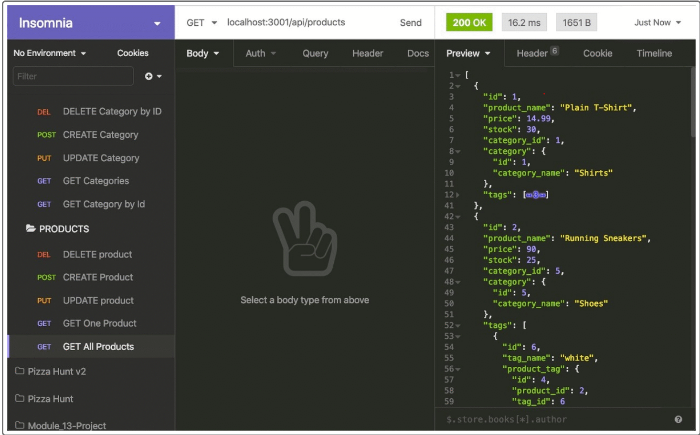

# E-commerce Back End Starter Code


Your challenge is to build the back end for an e-commerce site. You’ll take a working Express.js API and configure it to use Sequelize to interact with a MySQL database.


---
## About

Internet retail, also known as e-commerce, is the largest sector of the electronics industry, having generated an estimated US$29 trillion in 2017 (Source: United Nations Conference on Trade and Development). E-commerce platforms like Shopify and WooCommerce provide a suite of services to businesses of all sizes. Due to the prevalence of these platforms, developers should understand the fundamental architecture of e-commerce sites.

---

### User Story
```
AS A manager at an internet retail company
I WANT a back end for my e-commerce website that uses the latest technologies
SO THAT my company can compete with other e-commerce companies
```
---

### Criteria
```

GIVEN a functional Express.js API
WHEN I add my database name, MySQL username, and MySQL password to an environment variable file
THEN I am able to connect to a database using Sequelize
WHEN I enter schema and seed commands
THEN a development database is created and is seeded with test data
WHEN I enter the command to invoke the application
THEN my server is started and the Sequelize models are synced to the MySQL database
WHEN I open API GET routes in Insomnia for categories, products, or tags
THEN the data for each of these routes is displayed in a formatted JSON
WHEN I test API POST, PUT, and DELETE routes in Insomnia
THEN I am able to successfully create, update, and delete data in my database
```
---

## Mock Up


---

### Installation
[REPO]()

[Express.js](https://expressjs.com/en/starter/installing.html)

[DB-JSON](https://www.npmjs.com/package/db-json)

[Heroku](https://www.heroku.com/)

---

### Usage

To run application take the following steps:
1. Clone repo to your computer.
2. Install and run express.js by running npm install expess.
3. After saving code run npm start.
4. Open new live server and type in localhost:3001.
5. After you run the live server you can add and delete your notes. 

---

### Screenshot
:movie_camera:	
[Demo Video]()

---

#### Author

:black_nib:	Built and maintain by [Ashley Walker](https://github.com/lawalker4)

---

#### Contact me with any questions you might have
:mailbox_with_mail:
Email: lauraashleywalker4@gmail.com